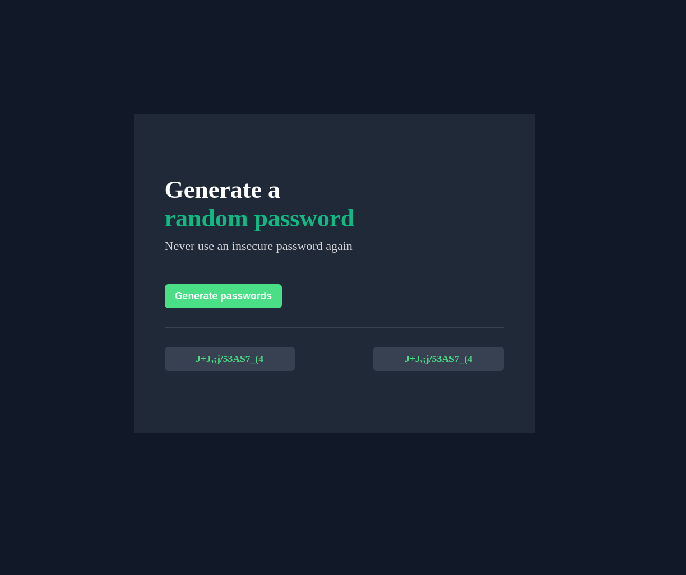

WORK IN PROGRESS

## Table of contents

- [Overview](#overview)
  - [The challenge](#the-challenge)
  - [Screenshot](#screenshot)
  - [Links](#links)
- [My process](#my-process)
  - [Built with](#built-with)
  - [What I learned](#what-i-learned)
  - [Continued development](#continued-development)
  - [Useful resources](#useful-resources)

## Overview

In our day and age, it is crucial to have a strong password.  
And I have a BIG PROBLEM thinking of secure passwords that are not as basic as helloWord123, or sunshineKiller6969, those passwords of mine are long in the past (or not :D).  
So to battle my simple password generation I came up with the idea to create my own password generator.

### The challenge

Users should be able to:

- See hover effect over generate password button.
- When clicked generate two separate passwords
- Copy password to clipboard on click"
- Changes the text of passwordField field to "Copied !"

### Screenshot

### Links

- Live Site URL: [Password generator LIVE](https://passwordgeneratorappv1.netlify.app)

## My process

### Built with

- HTML5 Semantic
- CSS
- JavaScript

### What I learned

In this project, so much new stuff was learned.  
One should also mention that this project was completed without any tutorials.  
Prior to this project, struggling with functions, arrays, and loops was common, but after this experience, it can be confidently said that those beasts were tamed, and there's now a solid understanding of how they work and when to use them.  
Additionally, all the code was initially written as pseudo-code in a notebook, where the logic was laid out before coding, which helped immensely in figuring out what to use and where.  
Also big mention is that i`ve used git branches to simulate generating new features.

### Continued development

- Add slider for how long passwords should be.
- Add togle on/off for special characters and symbols.
